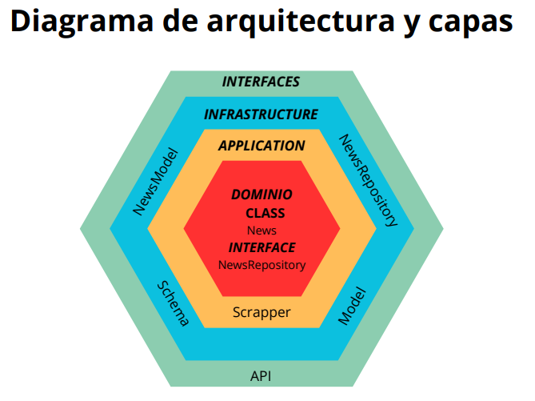
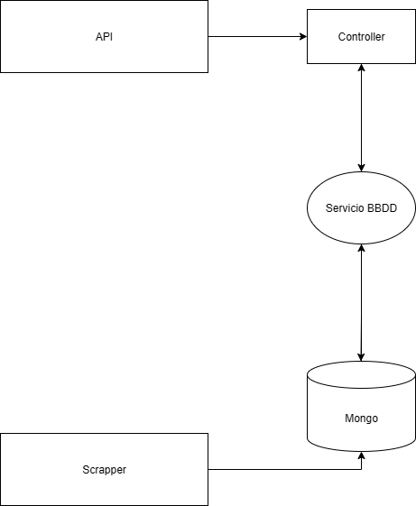

## Daily Trends app

- Proyecto de una app con un servicio de scrapping de noticias y un servicio API Rest que integra con MongoDB. Al iniciar el proyecto, empieza el proceso de scrapping de la web de [El País](https://elpais.com) para recuperar las 5 primeras noticias de la portada. 
- Una vez obtenidas, las almacena en una base de datos MongoDB, en forma de documentos JSON.

- Este proyecto cuenta también con una API para consumir las noticias guardadas en BBDD con 2 endpoints:
  - Recuperar todas las noticias guardadas en BBDD: /api/news/get-all-news
  - Filtrar las noticias por fuente (en este caso, El País): /api/news/get-source-news

### Instrucciones para arrancar el proyecto 🚀

- Si es la primera vez que inicias el proyecto, ejecuta en la terminal el comando:

```bash
npm install

```

- Una vez instaladas las dependencias, arranca el proyecto con el comando:

```bash
npm run dev

```
**_nota_**: posiblemente no te funcione el servicio en local debido a que la cadena de conexión con Mongo se encuentra en el fichero .env que no está incluído en el repositorio

### Tecnologías utilizadas 🤖

- La API que sirve las noticias está desarrollada en NodeJS uyilizando el framework Express
- La integración con Mongo se realiza mediante la librería Mongoose, la cual proporciona, además de un método simple para conectar con la bbdd, un ODM con el que trabajar con los documentos
- Para recuperar las noticias, he utilizado la librería Puppeteer y JSdom, ya que investigando en blogs, recomiendan utilizarlas conjuntamente.


### Puntos a destacar:

- En un primer momento pensé en separar el servicio de scrapper y api pero finalmente decidí desarrollarlo en el mismo servicio. La idea inicial era que el proceso de scrapper se ejecutara mediante cron (no era un requisito de la aplicación) y utilizar threads para no bloquear el hilo principal mientras el scrapper funcionaba


## Diagrama de arquitectura:




## Modelado del dominio:

